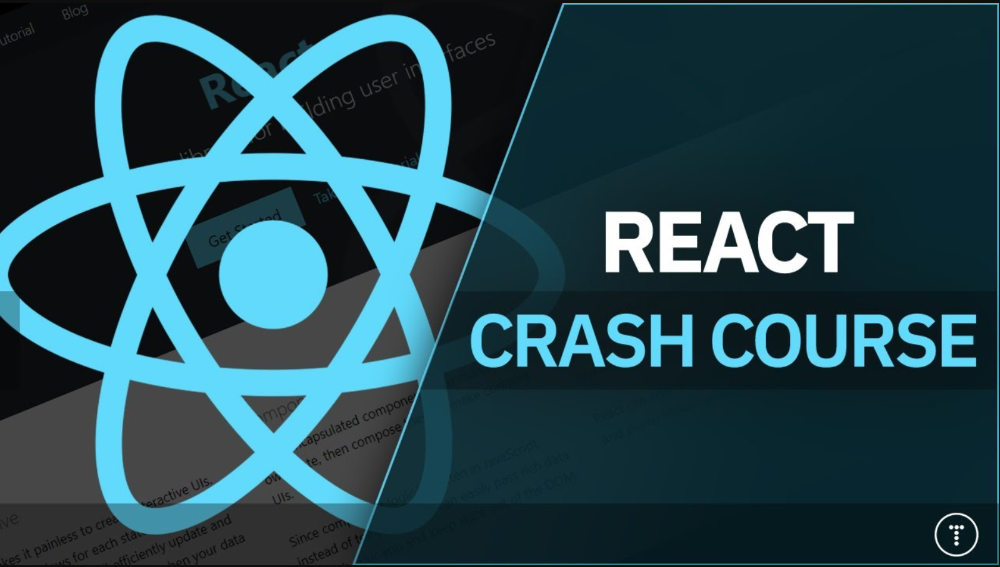

# Traversy Media

https://www.youtube.com/watch?v=w7ejDZ8SWv8&ab_channel=TraversyMedia 

> Get started with React in this crash course. We will be building a task tracker app and look at components, props, state, hooks, working with an API and more.

Project --> **Task Tracker Exampl**e 
Channel --> **Traversy Media 2,15 mi de inscritos**  
Date Created --> **18 de jan. de 2021**

### Observations

-  create-react-app
-  json-server
-  react-router-dom
-  add task functionality that you can toggle on home page
   -  no /create route
-  reminder functionality thats attached to the task
   -  changes the side color of the task when enabled

### Components

-  AppMain
   -  Header
   -  Footer
   -  Aboutk
   -  AddTask
   -  Button
   -  Tasks
      -  Task
      -  TaskDetails

### Topics Convered

-  Intro
-  Create react app w/ **npx create-react-app**
-  Folder structure
-  App component
-  JSX
-  Creating a Component
-  Props
-  PropTypes
-  Styling
-  Events
-  .map()
-  State & useState Hook
-  Global State
-  react-icons
-  prop drilling
-  Form input state (controlled components)
-  Build for production
-  JSON Server
-  useEffect hook
-  fetch() API
-  Routing
-  Footer
-  About page
